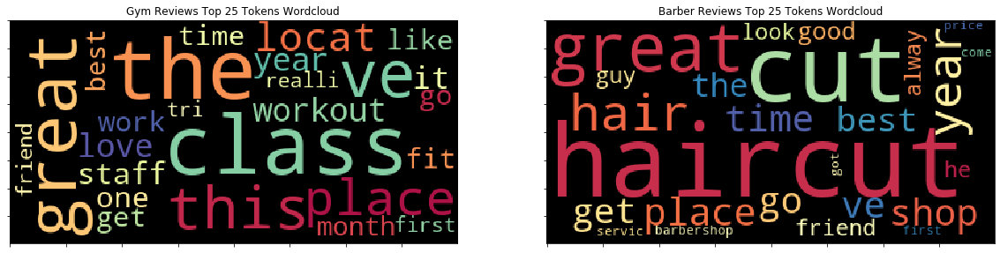

# Yelp NLP

## Introduction
My modeling goal was to build a model that could predict whether a yelp review was for a gym category business or a barbershop category business.  I downloaded the 140 character yelp review snippets from the Yelp Fusion API and read them into pandas, resulting in 3,000 datapoints with even class balance.  I modeled the data using naive bayes, random forest, gradient boosting and a voting classifier.  The voting classifier was the top performing model with a test set f1 score of .914, which outperformed the dummy classifier baseline model test set f1 score of .497.  Naive Bayes was the top performing single model with a test set f1 score of .895.

## Obtain Data
I downloaded the 3,000 140 character yelp review snippets for 1,000 businesses from the yelp fusion api.  I intentionally chose to download 1,500 reviews each for two categories, barbershops and gyms, which while vaguely related in terms of beautifying the body, where different enough to likely yield a strong classification model.

## Scrub Data
I tokenized the reviews, removed standard stopwords, and stemmed the reviews using the nltk package.  After reviewing the tokens, I removed additional custom stopwords based upon words common to the 25 most frequent tokens in both classes.  I then vectorized the reviews using sklearn tfidf.

## Explore Data

For EDA, I created wordclouds of the 25 most frequent words for the gym and barbershop classes.  Many of the top tokens for both business classes were directly related to what they did, such as ‘fit’/‘workout’ for Gyms and ‘haircut’/‘hair’ for Barbers. Both wordclouds also included words more indirectly associated with the activities of both classes, like ‘month’ referring to the fact that gym memberships tend to be monthly and ‘guy’ referring to the fact that barbers often specialize in a single gender. There was also some general review terminology common to both classes, including ‘great’, ‘friend’ and ‘time’. I could have added a list of yelp stopwords to my stopwords but I thought developing this list would consume a lot of time, so I decided to dive into modeling first to see how it would perform.

## Model Data
I used f1 score as my principle evaluation metric in order to create a model that would accurately predict members of both the gym and barbershop classes. I used a 75/25 train test split to validate my models.  The baseline dummy classifier model produced a test set f1 score of .497.  

I first built a naive bayes model, which performed strongly with an f1 score of .895 compared to the baseline model performance of .497.  Naive bayes was slightly skewed towards overclassifying datapoints as Barbershop.  It classified 53.6% of points as Barber and had a specificity of .871 for Barbershops compared to a sensativity of .931 for Gyms.

I next built a random forest model, which performed similarly to naive bayes with a slightly lower f1 score of .892.  Random forest overclassified points as members of the gym class, classifying 54.6% of points as Gym with a sensativity of .855 for Gyms compared to a specificity of .925 for Barbershops.

I wanted to see if a gradient boost model would improve on the performance of previous models but this did not happen as it underperformed the other two models with an f1 score of .877.  This underperformance was the result of a greater skew towards overclassifying points as belonging to the Gym class.  The gradient boost model classified 61.2% of points as Gym reviews with a sensativity of .797 for Gym datapoints compared to a specificity of .968 for Barbershop datapoints.

I finally built a voting classifier model based upon naive bayes, random forest and gradient boost.  This model outperformed these models indivudally with an f1 score of .914.  This model was skewed towards overclassifying datapoints as members of the Gym class with 56.5% of points classified as such and a sensativity of .862 for Gym revies compared to a specificity of .968 for Barbershop reviews.

## Analyze Results
A soft voting classifier model based upon naive bayes, random forest and gradient boost was the top performer compared to each of these individual models and other voting classifiers.  The soft voting classifier performed strongly with a test set f1 score of .914, compared to the dummy classifier test set f1 score of .497.  The classifier was slightly skewed towards overclassifying datapoints as belonging to the Gym class, likely as a result of both Random Forest and Gradient Boosting skewing towards Gym predicitions, while only Naive Bayes overclassified datapoints as Barber members.  However the similarly strong performance of these three models combined with their slightly different orientations contributed to a voting model based on all three outperforming each one.

## Next steps
With more time, I would like to expand my modeling to more similar categories of business reviews in order to test if it maintains its strong performance for two distinct classes in Gyms and Barbershops.  

# Github Files
[Modeling.ipynb](https://github.com/blantj/yelp_nlp/blob/main/Modeling.ipynb) :  Yelp nlp classification modeling

# Sources
Kaggle: https://www.yelp.com/fusion
